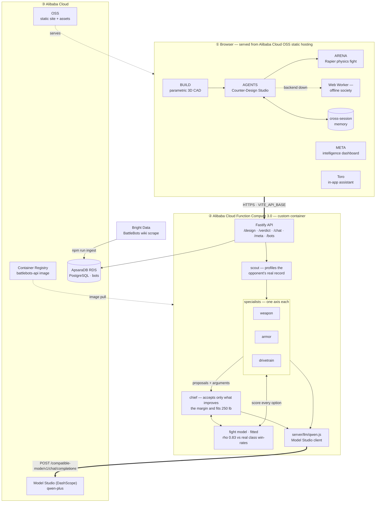
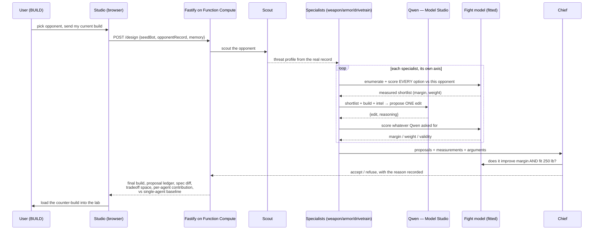

# Architecture — BattleBots Design Lab

Track 3: **Agent Society**. Five specialist agents, each owning one axis of a
combat-robot design, negotiate a build against a specific opponent. Every agent
reasons through **Qwen on Alibaba Cloud Model Studio**; every proposal is scored
against a fight model fitted to real historical results before it can be accepted.

## System

## Design round — sequence

## Why it is a society, not a prompt chain

- **Task division.** Each specialist owns exactly one axis (weapon / armor /
  drivetrain) and can only emit edits for that axis. The scout owns intel; the
  chief owns acceptance.
- **Disagreement resolution.** Specialists optimise their own axis and routinely
  ask for weight the budget cannot pay. The chief arbitrates against a shared,
  measurable objective — predicted margin under the 250 lb cap — and every
  refusal is recorded in the ledger with its reason.
- **Grounding.** Qwen may propose anything, including options outside the
  shortlist, but a proposal is re-scored server-side before it can be accepted.
  Qwen can influence a build; it cannot ship an unverified one.
- **Measured efficiency gain.** A single generalist agent, given the same
  starting bot and the same budget but no scouting and no axis division, is run
  on every request. The studio reports the margin delta between the society and
  that baseline — the Track 3 requirement, computed live, not claimed.
- **Graceful degradation.** If Model Studio or the backend is unreachable, the
  in-browser deterministic society takes over and the UI never breaks.

## Files

| Concern | Path |
|---|---|
| **Alibaba Cloud Model Studio client (Qwen)** | [`server/llm/qwen.js`](../server/llm/qwen.js) |
| Specialist agents, scout, chief, negotiation | [`server/agents/`](../server/agents/) |
| Multimodal design reviewer (`qwen-vl-max`, sees the viewport) | [`server/agents/visionAgent.js`](../server/agents/visionAgent.js) |
| Fight model + calibration against real results | `server/agents/headlessMatch.js`, `server/agents/calibration.js` |
| Single-agent baseline (efficiency comparison) | `server/agents/baseline.js` |
| REST API | [`server/api/app.js`](../server/api/app.js) |
| **Alibaba Cloud deployment** | [`deploy/`](../deploy/) |
| Parametric bot physics (SI) | `src/lib/domain/` |
| 3D CAD scene / editor | `src/lib/scene/`, `src/components/lab/` |
| Rapier fight arena | `src/lib/sim/`, `src/components/arena/` |
| Counter-Design Studio UI | `src/lib/design/`, `src/components/design/` |
| Cross-session memory | `src/lib/memory/` |
| Bright Data ingest | `server/ingest/` |
